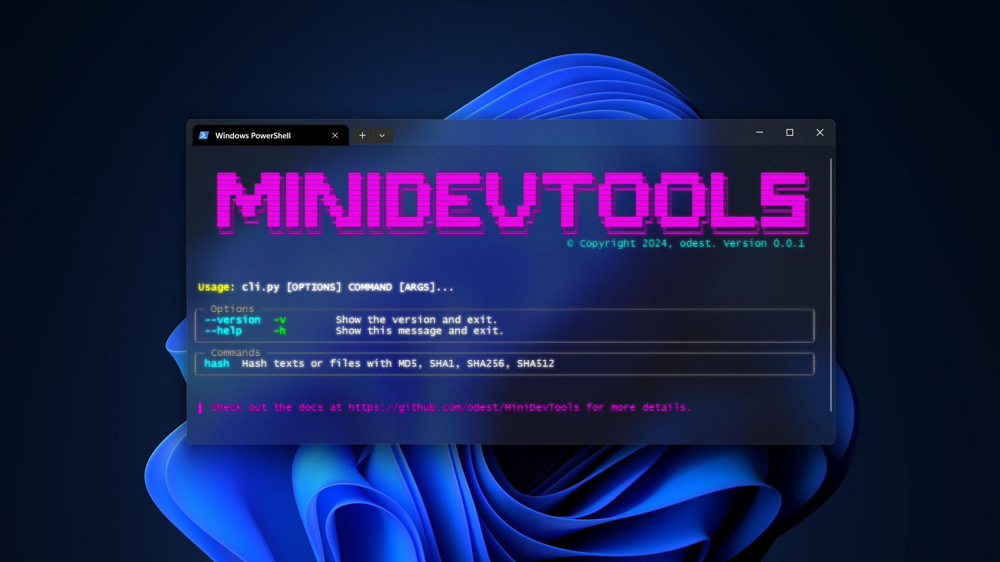

<p align="center">

</p>

<br> 

<div align="center">

MiniDevTools
===========================
<h4> A Swiss Army Knife for Developers </h4>

[](https://github.com/odest/iClock)
[](https://www.python.org/downloads/release/python-3120/)
[](https://github.com/odest/iClock)
[](https://github.com/odest/iClock)
[](https://github.com/odest/iClock?tab=GPL-3.0-1-ov-file#readme)
---

<br>

<div align="center">

MiniDevTools is a developer tools project designed to empower users to manage their data directly on their own computers without the need to share it with others. It offers a seamless experience for users to handle tasks easily, quickly, and offline.

</div></div>

<br>

<center>



</center>


## Table of Contents

- [Table of Contents](#table-of-contents)
- [Features](#features)
- [Tools](#tools)
  - [1. HashTool](#1-hashtool)
- [Installation](#installation)
- [Usage](#usage)
  - [1. As a Package](#1-as-a-package)
  - [2. Command Line Interface (CLI)](#2-command-line-interface-cli)
  - [3. Graphical User Interface (GUI)](#3-graphical-user-interface-gui)
- [License](#license)


<br>


## Features

- **Privacy-focused**: *With* **MiniDevTools**, *users can work with their data locally, ensuring their privacy and security are maintained at all times.*

- **Offline functionality**: *Whether you're in a remote location or experiencing internet connectivity issues,* **MiniDevTools** *ensures that you can continue your work without interruption.*

- **Open Source**: **MiniDevTools** *is* **open source**, *allowing you to inspect and modify the code according to your requirements, and contribute to its development.*

- **Cross-Platform Compatibility**: *Whether you're using* **Windows, macOS**, *or* **Linux**, **MiniDevTools** *works seamlessly across different operating systems.*

- **Efficiency**: *Perform tasks efficiently and effectively with* **MiniDevTools**' *intuitive interface and streamlined processes.*

- **Customizable**: *Tailor* **MiniDevTools** *to suit your specific needs with customizable options and settings.*

- **Developer-friendly**: *Built with developers in mind,* **MiniDevTools** *offers a range of features and functionalities to support your workflow.*

- **Flexible Usage**: **MiniDevTools** *provides versatile usage options, including a* **Command Line Interface (CLI)**, **Graphical User Interface (GUI)**, *and seamless* **Package Integration** *into* **Python** *projects.*

<br>


## Tools

### 1. HashTool

**HashTool** *is a versatile tool that caters to the needs of developers, security professionals, and anyone who values data integrity and security. Whether you need to hash sensitive information or verify file authenticity, HashTool provides the tools you need to get the job done efficiently and securely.*

   **Features:**

   - **Hashing Text**: **HashTool** *allows you to hash text strings securely using various hashing algorithms such as* **MD5, SHA-1, SHA-256**, *and* **SHA-512**.

   - **Hashing Files**: *With* **HashTool**, *you can generate hashes for files of any type and size. Simply provide the file path, and* **HashTool** *will compute the hash value for you.*

   - **Multiple Hash Algorithms**: **HashTool** *supports a wide range of hash algorithms, giving you the flexibility to choose the one that suits your security requirements.*


<br>

## Installation


*To install* **MiniDevTools** *from* **source**, *follow these steps:*

1. *Clone the repository:*

    ```bash
    git clone https://github.com/odest/MiniDevTools.git
    ```

2. *Navigate to the* **MiniDevTools** *directory:*

    ```bash
    cd MiniDevTools
    ```

3. *Install the required dependencies using* **pip:**

    ```bash
    pip install -r requirements.txt
    ```


<br>

  *By following these steps, you will have successfully installed* **MiniDevTools** *and its dependencies.*

<br>


## Usage

**MiniDevTools** *offers three options for usage:*

<br>

### 1. As a Package

*Integrate* **MiniDevTools** *into your own code or project as a package. Simply import it as follows:*

```python
from minidevtools import HashTool

# Hashing text
hash_text = HashTool.SHA256(text="Hello, world!")
print("Hashed text with SHA256:", hash_text)

# Hashing file
hash_file = HashTool.SHA256(file="image.png")
print("Hashed file with SHA256:", hash_file)
```

*You can then use the functionalities provided by* **MiniDevTools** *within your codebase.*

<br>

### 2. Command Line Interface (CLI)

> [!NOTE]
> *The project is currently not uploaded to PyPI, so it is used in the following manner.*

<br>

*Utilize* **MiniDevTools** *via the* **Command Line Interface (CLI)** *for quick and efficient tasks. Execute the CLI script as follows:*

```bash
python cli.py
```

<br>

```
Usage: cli.py [OPTIONS] COMMAND [ARGS]...

╭─ Options ───────────────────────────────────────────────────────────────╮
│ --version  -v        Show the version and exit.                         │
│ --help     -h        Show this message and exit.                        │
╰─────────────────────────────────────────────────────────────────────────╯

╭─ Commands ──────────────────────────────────────────────────────────────╮
│ hash  Hash texts or files with MD5, SHA1, SHA256, SHA512                │
╰─────────────────────────────────────────────────────────────────────────╯

 ▌ Check out the docs at https://github.com/odest/MiniDevTools for more details.
```

<br>

```
Usage: cli.py hash [OPTIONS]

 Hash texts or files with MD5, SHA1, SHA256, SHA512

╭─ Options ───────────────────────────────────────────────────────────────────────╮
│ --text      -t      TEXT                      Text to be hashed.                │
│                                               [default: None]                   │
│ --file      -f      TEXT                      File to be hashed.                │
│                                               [default: None]                   │
│ --algoritm  -a      [md5|sha1|sha256|sha512]  Hashing algorithm to be used.     │
│                                               [default: HashAlgorithm.SHA256]   │
│ --help      -h                                Show this message and exit.       │
╰─────────────────────────────────────────────────────────────────────────────────╯
```

*This allows you to access* **MiniDevTools**' *features directly from the command line.*

<br>

### 3. Graphical User Interface (GUI)

*Experience* **MiniDevTools'** *capabilities through the* **Graphical User Interface (GUI)** *for a user-friendly interaction. Launch the GUI to access its functionalities effortlessly.*


> [!NOTE]
> *The GUI option is currently under development and will be available soon.*


<br>

*Choose the option that best suits your workflow and preferences to make the most out of* **MiniDevTools.**

<br>

## License  
- *This project is licensed under the* **GPL-3.0 License** - *see the* [LICENSE](https://github.com/odest/iClock?tab=GPL-3.0-1-ov-file) *file for details.*


<br>


## 

<div align="center">
MiniDevTools - Empowering Developers Everywhere
</div>
